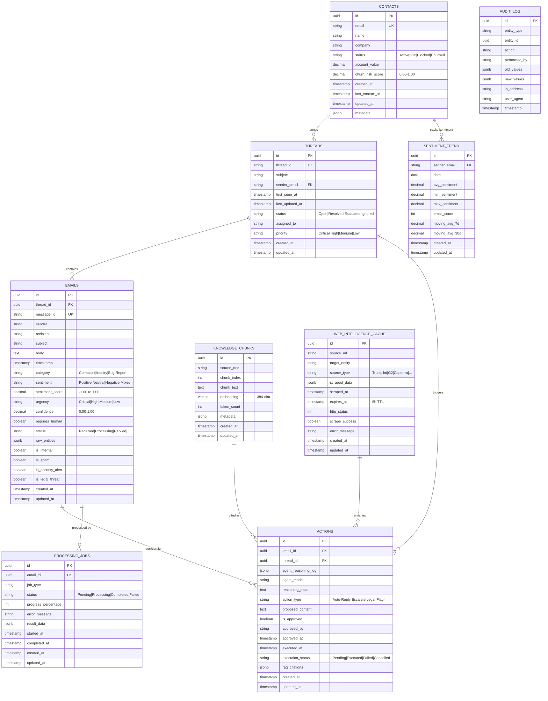

```mermaid
erDiagram
    CONTACTS ||--o{ THREADS : sends
    CONTACTS ||--o{ SENTIMENT_TREND : "tracks sentiment"
    THREADS ||--o{ EMAILS : contains
    THREADS ||--o{ ACTIONS : triggers
    EMAILS ||--o{ ACTIONS : "decision for"
    EMAILS ||--o{ PROCESSING_JOBS : "processed by"
    KNOWLEDGE_CHUNKS ||--o{ ACTIONS : "cited in"
    WEB_INTELLIGENCE_CACHE ||--o{ ACTIONS : "enriches"

    CONTACTS {
        uuid id PK
        string email UK
        string name
        string company
        string status "Active|VIP|Blocked|Churned"
        decimal account_value
        decimal churn_risk_score "0.00-1.00"
        timestamp created_at
        timestamp last_contact_at
        timestamp updated_at
        jsonb metadata
    }

    THREADS {
        uuid id PK
        string thread_id UK
        string subject
        string sender_email FK
        timestamp first_seen_at
        timestamp last_updated_at
        string status "Open|Resolved|Escalated|Ignored"
        string assigned_to
        string priority "Critical|High|Medium|Low"
        timestamp created_at
        timestamp updated_at
    }

    EMAILS {
        uuid id PK
        uuid thread_id FK
        string message_id UK
        string sender
        string recipient
        string subject
        text body
        timestamp timestamp
        string category "Complaint|Inquiry|Bug Report|..."
        string sentiment "Positive|Neutral|Negative|Mixed"
        decimal sentiment_score "-1.00 to 1.00"
        string urgency "Critical|High|Medium|Low"
        decimal confidence "0.00-1.00"
        boolean requires_human
        string status "Received|Processing|Replied|..."
        jsonb raw_entities
        boolean is_internal
        boolean is_spam
        boolean is_security_alert
        boolean is_legal_threat
        timestamp created_at
        timestamp updated_at
    }

    ACTIONS {
        uuid id PK
        uuid email_id FK
        uuid thread_id FK
        jsonb agent_reasoning_log
        string agent_model
        text reasoning_trace
        string action_type "Auto-Reply|Escalate|Legal-Flag|..."
        text proposed_content
        boolean is_approved
        string approved_by
        timestamp approved_at
        timestamp executed_at
        string execution_status "Pending|Executed|Failed|Cancelled"
        jsonb rag_citations
        timestamp created_at
        timestamp updated_at
    }

    KNOWLEDGE_CHUNKS {
        uuid id PK
        string source_doc
        int chunk_index
        text chunk_text
        vector embedding "384-dim"
        int token_count
        jsonb metadata
        timestamp created_at
        timestamp updated_at
    }

    WEB_INTELLIGENCE_CACHE {
        uuid id PK
        string source_url
        string target_entity
        string source_type "Trustpilot|G2|Capterra|..."
        jsonb scraped_data
        timestamp scraped_at
        timestamp expires_at "6h TTL"
        int http_status
        boolean scrape_success
        string error_message
        timestamp created_at
        timestamp updated_at
    }

    SENTIMENT_TREND {
        uuid id PK
        string sender_email FK
        date date
        decimal avg_sentiment
        decimal min_sentiment
        decimal max_sentiment
        int email_count
        decimal moving_avg_7d
        decimal moving_avg_30d
        timestamp created_at
        timestamp updated_at
    }

    PROCESSING_JOBS {
        uuid id PK
        uuid email_id FK
        string job_type
        string status "Pending|Processing|Completed|Failed"
        int progress_percentage
        string error_message
        jsonb result_data
        timestamp started_at
        timestamp completed_at
        timestamp created_at
        timestamp updated_at
    }

    AUDIT_LOG {
        uuid id PK
        string entity_type
        uuid entity_id
        string action
        string performed_by
        jsonb old_values
        jsonb new_values
        string ip_address
        string user_agent
        timestamp timestamp
    }
```
