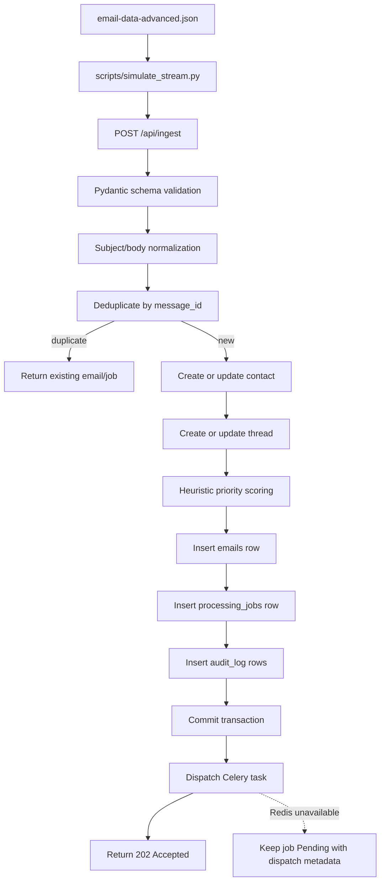

# Phase 01: Email Ingestion Pipeline

## Purpose

The ingestion pipeline is the first production boundary of the CRM intelligence
platform. Its job is to accept raw email events, validate and normalize them,
deduplicate repeated deliveries, link each email to a conversation thread, assign a
fast initial triage signal, persist the data in PostgreSQL, and create a background
processing job for later LLM/RAG/agent work.

This phase deliberately stops before LLM classification, RAG retrieval, reply
drafting, and LangGraph orchestration. Those systems will consume the clean records
created here.

## Scope

In scope:

- FastAPI application scaffold.
- SQLAlchemy models aligned with `backend/database_schema.sql`.
- Email ingest endpoint.
- Processing job status endpoint.
- Health endpoint.
- Middleware for CORS, request IDs, request timing, payload-size checks, and
  consistent error envelopes.
- Ingestion services for normalization, contact creation, thread linking,
  deduplication, priority scoring, job creation, audit logging, and Celery dispatch.
- Dataset replay simulator.

Out of scope for this phase:

- LLM classification.
- LangGraph agent execution.
- ChromaDB/RAG search.
- Frontend dashboard.
- Web intelligence scraping.
- Human approval workflow.

## Architecture



## Runtime Components

| Component | Files | Responsibility |
| --- | --- | --- |
| FastAPI app | `app/main.py`, `app/api/*` | API routing and exception handlers |
| Config | `app/core/config.py` | Environment-based settings |
| Middleware | `app/core/middleware.py` | CORS, request ID, timing, payload-size guard |
| Error handling | `app/core/errors.py` | Standard error envelope |
| DB layer | `app/db/models.py`, `app/db/session.py` | SQLAlchemy mappings and sessions |
| Schemas | `app/schemas/*` | Request and response contracts |
| Ingestion service | `app/services/ingestion_service.py` | End-to-end ingest transaction |
| Normalization | `app/services/normalization_service.py` | HTML/entity/whitespace cleanup and body truncation |
| Priority scoring | `app/services/priority_service.py` | Fast heuristic triage |
| Thread/contact services | `app/services/contact_service.py`, `app/services/thread_service.py` | Upsert-style CRM linking |
| Worker hook | `app/workers/*` | Celery app and post-ingestion task stub |
| Simulator | `../scripts/simulate_stream.py` | Replays dataset into the API |

## API Endpoints

Base path: `/api`

### `GET /health`

Root-level liveness check. This verifies the FastAPI process is reachable without
checking PostgreSQL.

Response:

```json
{
  "status": "ok",
  "service": "api",
  "database": "not_checked",
  "readiness": "/api/health"
}
```

### `GET /api/health`

Checks application and database availability.

Response:

```json
{
  "status": "ok",
  "database": "ok"
}
```

If PostgreSQL is not reachable, the endpoint returns `503`:

```json
{
  "error_code": "DATABASE_UNAVAILABLE",
  "message": "API is running, but PostgreSQL is not reachable.",
  "details": {
    "database": {
      "driver": "postgresql+psycopg2",
      "host": "localhost",
      "port": 5432,
      "database": "crm_ai"
    },
    "exception": "OperationalError",
    "hint": "Start PostgreSQL and apply backend/database_schema.sql, or update DATABASE_URL in backend/.env."
  }
}
```

### `POST /api/ingest`

Accepts one email payload, validates it, stores it idempotently, and creates a
background processing job.

Request:

```json
{
  "message_id": "msg_001",
  "sender": "alice.smith@greenlight-npo.org",
  "recipient": "support@mycompany.com",
  "subject": "Question about pricing",
  "body": "Hi, do you offer non-profit discounts?",
  "timestamp": "2023-10-01T09:00:00Z",
  "thread_id": "thread_alice_pricing"
}
```

Required fields:

- `message_id`
- `sender`
- `subject`
- `body`
- `timestamp`
- `thread_id`

Notes:

- `sender` and `recipient`, when present, must be valid email addresses.
- `subject` and `body` may be empty strings, but warnings are recorded.
- `timestamp` accepts ISO-8601 values and is stored as UTC without timezone.
- Unknown extra fields are ignored by the current schema.

Success response, new email:

```json
{
  "job_id": "6fb63f4e-3a69-4a79-bb0f-26de2f9aee51",
  "email_id": "78ee3468-10e0-4e17-9f34-196b5a3d6e54",
  "message_id": "msg_001",
  "status": "queued",
  "duplicate": false,
  "priority": "Medium",
  "priority_score": 20,
  "warnings": []
}
```

Success response, duplicate delivery:

```json
{
  "job_id": "6fb63f4e-3a69-4a79-bb0f-26de2f9aee51",
  "email_id": "78ee3468-10e0-4e17-9f34-196b5a3d6e54",
  "message_id": "msg_001",
  "status": "Pending",
  "duplicate": true,
  "priority": "Medium",
  "priority_score": 20,
  "warnings": []
}
```

### `GET /api/status/{job_id}`

Returns the state of the processing job created during ingestion.

Response:

```json
{
  "job_id": "6fb63f4e-3a69-4a79-bb0f-26de2f9aee51",
  "email_id": "78ee3468-10e0-4e17-9f34-196b5a3d6e54",
  "message_id": "msg_001",
  "job_type": "post_ingestion_triage",
  "status": "Pending",
  "progress_percentage": 0,
  "error_message": null,
  "result_data": {
    "requires_llm": true,
    "ingestion_priority": "Medium",
    "priority_score": 20
  },
  "created_at": "2026-06-11T00:00:00",
  "started_at": null,
  "completed_at": null
}
```

## Error Envelope

Every handled error returns the same shape:

```json
{
  "error_code": "VALIDATION_ERROR",
  "message": "Invalid request payload.",
  "details": {
    "errors": []
  }
}
```

Common error codes:

| Code | HTTP status | Meaning |
| --- | ---: | --- |
| `VALIDATION_ERROR` | 422 | Required field, email, timestamp, or type validation failed |
| `PAYLOAD_TOO_LARGE` | 413 | Request body exceeds `MAX_REQUEST_BYTES` |
| `JOB_NOT_FOUND` | 404 | Unknown processing job ID |
| `DATABASE_INTEGRITY_ERROR` | 409 | Database uniqueness or FK conflict |
| `DATABASE_ERROR` | 503 | General database failure |
| `INTERNAL_SERVER_ERROR` | 500 | Unexpected application failure |

## Database Mapping

This phase follows the existing SQL schema instead of introducing a separate
ingestion schema.

| Table | Ingestion use |
| --- | --- |
| `contacts` | Created or updated from `sender`; name/company inferred from email address |
| `threads` | Created or updated by external `thread_id`; priority and status are updated from heuristics |
| `emails` | Stores normalized email content, dedup key, first-pass category, urgency, flags, and JSON metadata |
| `processing_jobs` | Tracks the async post-ingestion job |
| `audit_log` | Records email ingestion and job creation |

Important existing indexes/constraints:

- `emails.message_id` is unique and is the idempotency key.
- `threads.thread_id` is unique and links incoming messages to conversations.
- `contacts.email` is unique and supports CRM profile lookup.
- `emails.thread_id`, `emails.sender`, `emails.timestamp`, and `processing_jobs.status`
  support later dashboard and worker queries.

Ingestion-only metadata is stored in `emails.raw_entities.ingestion`:

```json
{
  "ingestion": {
    "external_thread_id": "thread_alice_pricing",
    "priority_score": 20,
    "priority_reasons": ["default_priority"],
    "warnings": [],
    "original_body_length": 102,
    "normalized_body_length": 102,
    "processing_body": "Hi, do you offer non-profit discounts?"
  }
}
```

## Ingestion Algorithm

1. Validate request with `EmailIngestRequest`.
2. Look up `emails.message_id`.
3. If the message already exists, return the existing email and latest job.
4. Normalize subject and body:
   - HTML entities are unescaped.
   - HTML tags are removed.
   - Repeated whitespace is collapsed.
   - empty subject/body warnings are recorded.
   - body text over `EMAIL_PROCESSING_BODY_LIMIT` is truncated only for downstream
     processing metadata.
5. Run fast heuristic scoring.
6. Create or update `contacts`.
7. Create or update `threads`.
8. Insert `emails`.
9. Insert `processing_jobs`.
10. Insert `audit_log` rows.
11. Commit the transaction.
12. Dispatch Celery task.
13. Return `202 Accepted`.

The commit happens before Celery dispatch. This ensures the email is not lost if
Redis or the worker is unavailable.

## Priority And Routing Heuristics

The heuristic layer is intentionally simple and synchronous. It provides immediate
triage while leaving final classification to the later LLM engine.

Signals:

- Spam keywords and known spam domains.
- Internal sender domains: `internal.com`, `mycompany.com`.
- Urgency words: `urgent`, `P0`, `critical`, `production down`, `outage`.
- Security words: `ransomware`, `suspicious login`, `data breach`, `malware`.
- Legal/compliance words: `legal`, `cease and desist`, `GDPR`, `Article 20`,
  `HIPAA`, `DPA`.
- Complaint, bug, billing, and feature-request keywords.

Outputs:

- `emails.category`
- `emails.urgency`
- `emails.confidence`
- `emails.requires_human`
- `emails.is_internal`
- `emails.is_spam`
- `emails.is_security_alert`
- `emails.is_legal_threat`
- `threads.priority`
- `threads.status` when critical escalation is detected

Critical security and legal signals are marked for human handling immediately.
Spam and internal messages are marked as `Ignored` for now so they do not enter the
future LLM flow by default.

## Edge Cases

| Edge case | Current handling |
| --- | --- |
| Duplicate `message_id` | Returns existing email/job with `duplicate: true`; no second email row |
| Empty subject | Accepted; normalized to empty string; `EMPTY_SUBJECT` warning recorded |
| Empty body | Accepted; normalized to empty string; `EMPTY_BODY` warning recorded |
| Whitespace-only body | Accepted; normalized to empty string; `EMPTY_BODY` warning recorded |
| HTML entities/tags | Unescaped and stripped during normalization |
| Body over 10,000 characters | Full normalized body is stored; processing copy is truncated in metadata |
| Malformed JSON | FastAPI returns validation/error response |
| Missing required field | 422 `VALIDATION_ERROR` |
| Invalid sender email | 422 `VALIDATION_ERROR` |
| Invalid timestamp | 422 `VALIDATION_ERROR` |
| Out-of-order timestamps | Thread `first_seen_at` and `last_updated_at` are adjusted correctly |
| Redis/Celery unavailable | Email and job remain committed; job gets dispatch failure metadata |

## Performance Targets

Targets inherited from the assessment and design:

| Operation | Target | Design support |
| --- | ---: | --- |
| Heuristic pre-filter | <10 ms | In-process keyword checks; no network calls |
| Ingest request excluding DB/network variance | <100 ms | Single transaction, indexed lookups, no LLM calls |
| Dev simulator speed | 1 email/sec | `--speed 1` |
| Load-test simulator speed | 10 emails/sec | `--speed 10` |
| Future thread fetch up to 50 emails | <100 ms | `emails.thread_id` and `threads.thread_id` indexes |

Benchmarks are not yet recorded because the local database/runtime was not started
in this phase. Once PostgreSQL is running, measure with the simulator and include
latency percentiles in the README.

## Setup

Install dependencies:

```bash
cd backend
python -m venv .venv
.venv\Scripts\activate
pip install -r requirements.txt
copy .env.example .env
```

Apply schema:

```bash
psql -U postgres -d crm_ai -f database_schema.sql
```

Or use the Python helper:

```bash
python scripts/apply_schema.py
```

If `psql` is not installed locally, use the project Docker Compose file from the
repository root:

```bash
docker compose up -d postgres redis
```

The Postgres container uses the `pgvector/pgvector:pg17` image and loads
`backend/database_schema.sql` on first database initialization.

Run API:

```bash
uvicorn app.main:app --reload
```

Run worker when Redis is available:

```bash
celery -A app.workers.celery_app.celery_app worker --loglevel=info
```

## Simulator

Dry run without sending HTTP requests:

```bash
python scripts/simulate_stream.py --dry-run --limit 3
```

Replay at development speed:

```bash
python scripts/simulate_stream.py --speed 1
```

Replay faster for load testing:

```bash
python scripts/simulate_stream.py --speed 10 --limit 20
```

Replay out of order:

```bash
python scripts/simulate_stream.py --shuffle --speed 10
```

## Manual Testing

Health:

```powershell
Invoke-RestMethod -Method Get -Uri http://localhost:8000/health
Invoke-RestMethod -Method Get -Uri http://localhost:8000/api/health
```

Ingest one email:

```powershell
$payload = @{
  message_id = "manual_001"
  sender = "alice.smith@greenlight-npo.org"
  subject = "Question about pricing"
  body = "Do you offer non-profit discounts?"
  timestamp = "2023-10-01T09:00:00Z"
  thread_id = "thread_manual_pricing"
} | ConvertTo-Json

Invoke-RestMethod -Method Post `
  -Uri http://localhost:8000/api/ingest `
  -ContentType "application/json" `
  -Body $payload
```

Test idempotency by sending the same payload twice. The second response should
include:

```json
{
  "duplicate": true
}
```

Test job status:

```powershell
Invoke-RestMethod -Method Get -Uri http://localhost:8000/api/status/<job_id>
```

Test malformed payload:

```powershell
Invoke-RestMethod -Method Post `
  -Uri http://localhost:8000/api/ingest `
  -ContentType "application/json" `
  -Body '{"message_id":""}'
```

Expected result: `422 VALIDATION_ERROR`.

## Database Verification Queries

Check email count:

```sql
SELECT COUNT(*) FROM emails;
```

Check deduplication:

```sql
SELECT message_id, COUNT(*)
FROM emails
GROUP BY message_id
HAVING COUNT(*) > 1;
```

Expected: zero rows.

Check thread linking:

```sql
SELECT t.thread_id, COUNT(e.id) AS email_count
FROM threads t
JOIN emails e ON e.thread_id = t.id
GROUP BY t.thread_id
ORDER BY email_count DESC;
```

Check critical/security/legal flags:

```sql
SELECT message_id, category, urgency, requires_human, is_security_alert, is_legal_threat
FROM emails
WHERE urgency = 'Critical'
   OR is_security_alert = TRUE
   OR is_legal_threat = TRUE
ORDER BY timestamp;
```

Check job dispatch metadata:

```sql
SELECT id, status, result_data
FROM processing_jobs
ORDER BY created_at DESC
LIMIT 10;
```

## Automated Checks Used In This Phase

Syntax compilation:

```bash
python -m compileall backend scripts
```

Simulator dry-run:

```bash
python scripts/simulate_stream.py --dry-run --limit 3
```

Future automated tests should cover:

- request validation failures.
- duplicate `message_id`.
- empty/whitespace/HTML body normalization.
- long-body truncation metadata.
- out-of-order timestamps within a thread.
- spam/internal/security/legal routing.
- Redis unavailable behavior.
- `/api/status/{job_id}` not-found behavior.

## Architecture Choices

### Existing SQL schema is the contract

The phase uses `database_schema.sql` as the source of truth. This avoids creating
new tables that later need reconciliation with the ER diagram and assessment
deliverables.

Trade-off: ingestion metadata without a dedicated column is stored in JSONB. This is
acceptable for phase one because the data is operational metadata, not a primary
query dimension.

### Synchronous ingest, asynchronous intelligence

The API writes the email and job synchronously, then dispatches background work.
This keeps ingestion fast and prevents LLM/RAG latency from blocking the inbox.

Trade-off: the first response only confirms ingestion and queueing, not final AI
classification.

### Commit before Celery dispatch

The transaction commits before worker dispatch. If Redis is down, the email remains
stored and can be reprocessed later.

Trade-off: a separate retry/reconciliation command will be useful in a later phase
to redispatch pending jobs.

### Heuristics are conservative

The heuristic layer is used for immediate routing only. Critical legal/security
signals are escalated early, while nuanced classification is deferred to the LLM
engine.

Trade-off: some categories may be rough in phase one, but dangerous cases are less
likely to be missed.

### Normalized text is stored

`emails.body` stores normalized text. A processing-specific truncated copy is kept
inside `raw_entities.ingestion.processing_body`.

Trade-off: preserving the exact raw payload may be useful for forensics. If needed,
a later migration should add a `raw_payload` JSONB column or store immutable source
events separately.

## Known Limitations

- No Alembic migration has been generated yet; the existing SQL file is still the
  schema entry point.
- No live benchmark has been recorded yet.
- No pytest suite exists yet.
- Celery task currently marks the job complete as a stub. Later phases will replace
  this with LLM classification, RAG retrieval, and LangGraph agent execution.
- The heuristic keyword lists are intentionally small and should be tuned after
  running the full dataset.
